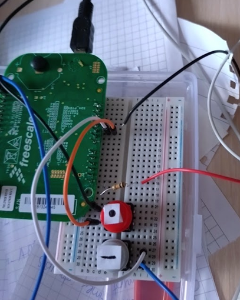

# Morse Decoder and Encoder Project  
My project for Morde Code encoder in C for a FRDM-KL05Z boart with 32-bit Cortex-M0 + core microcontroller in Keil uVision environment. This project uses UART communication with Termite to encode and decode the morse sequence.
## Installation
To run those files you need Keil uVision environment and J-Link Software. 
## Technologies
* Keil uVision environment
* J-Link
* Termite
* UART protocol
## Needed Hardware
*Buzzer
* 1k resistor
* 2 buttons 
* breadboard
* cables
  

## 

